# 手机壳过时了，现在流行236元的「手机袋」？

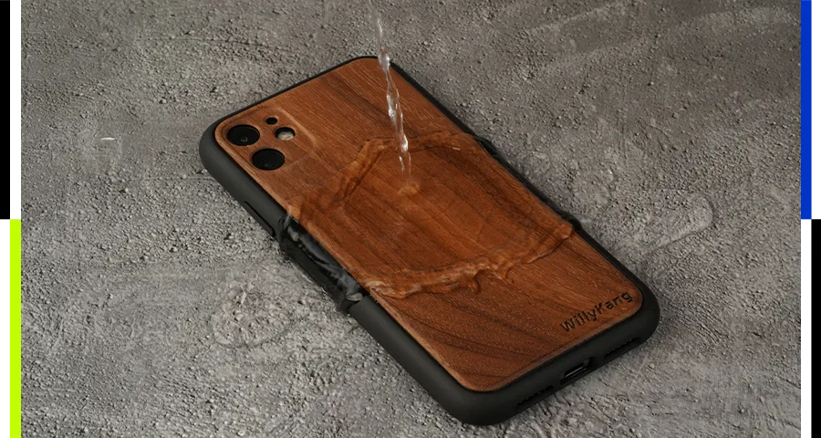

现在的手机泡了水就难顶。

**文****｜狐妹**

**编辑****｜**CR

**来源｜****科技狐（ID：kejihutv）**

**封面来源****｜pexels**

你们身边不用手机壳的朋友是不是越来越多啊？

先不说这大夏天的手机更容易发热，不用手机壳还好点。

主要目前市面上的手机，外观用材和制作工艺也越来越顶，同时也做了不同程度的防尘防水防摔。

所以不用手机壳确实更能体验到手机原本的舒适手感。

要说这防尘防摔还好，现在的手机磕了碰了摔了，其实没啥影响，主要还是泡了水就难顶。

像狐妹这种更多是通勤、室内使用的话倒是不至于，毕竟比较少机会让手机泡水，就算不小心沾水了，现在拿起来擦干放一放也没事。

而更多在户外行动的用户，相对而言需要重视这一点。

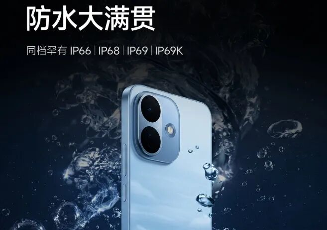

正因如此，国外一家很知名的防护数码配件厂商UAG，最近上了一款新品。

简单介绍下这个UAG，经营14年里，主打的就是军工级防护产品。

在今天要聊的这款新品之前，旗下代表性产品都是做的“事前防护壳”这一类。

例如旗舰五层层复合防护壳、Plyo透明壳、Essential Armor轻薄磁吸壳等等。

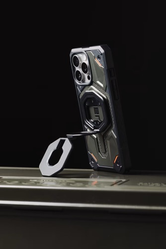

而今年算是全新尝试，直接出了“事后防护产品”整系列。

有手机款、耳机仓款、笔记本款、斜挎款、大容量托特款、双肩包款等等。

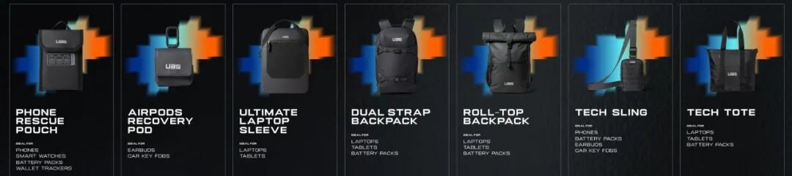

这么看好像没啥特别的哈。

咱主要来看看这个手机款新品，官方将其命名为Rescue Pouch救援袋，应该还是有说法的。

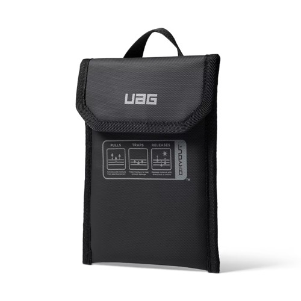

老规矩，定价放前面，官方售价34.95美元，约合人民币236元。

一个手机袋卖200多，主要跟它的配置、原理、效果有关。

这个小手机袋大概59g，外层用的耐磨尼龙、自带挂环、魔术贴密封，没啥特别的；

关键是内衬，官方强调是和Dryout合作的特种可循环吸湿材料内衬，原理类似高级可反复再生干燥剂。

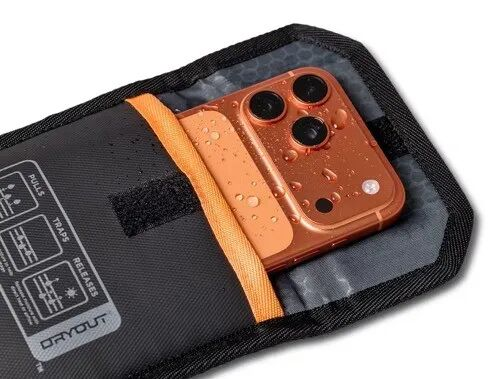

而它的实际使用效果呢，根据官方宣传的：

如果你的手机只是轻微进了水，或者淋了雨，亦或者收到充电口水汽警报；

这些情况你只需要把手机放进袋子就好了，说是2-5个小时它就可以吸收掉手机里面的水分。

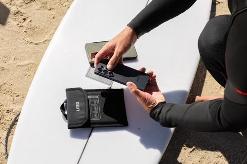

那如果问题比较严重，例如手机已经是泡了水、重度进水的话，那这个时间会更长，需要3-12个小时。

另外，用之前的话，需要手机关机、擦干手机表面的水、把手机壳拆开。

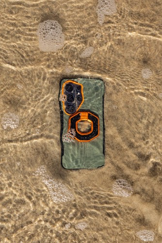

原理是啥呢？

官方介绍用这个内衬干燥技术，可以吸水、防生锈、防腐蚀、防短路。

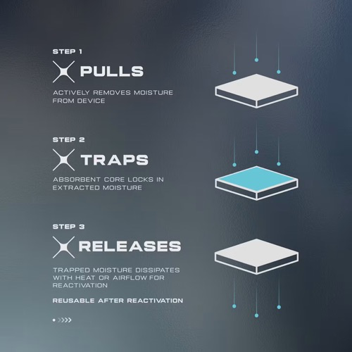

还有哇，这个袋子是支持循环使用的。

就算是手机严重泡水，那用完之后，这个袋子是可以晒干、晾干、吹干、烘干、烤干后反复使用的，毕竟是再生材料。

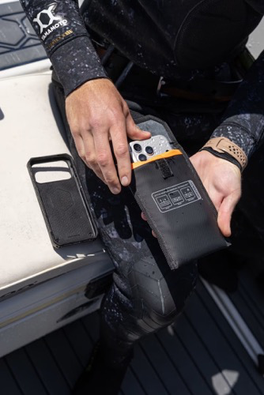

基本就这些了，你觉得这袋子卖236咋样？

实话说，个人觉得有点贵，但思路可以的，后续国产平替出来，把价格打到几十元就好接受了。

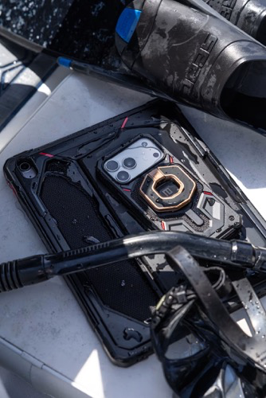

手机进水，从吸水的功能上说，网上主流的办法：

要么直接扔米缸里，这是土方法，米可以吸水，但其实会有粉尘进手机的风险；

也有思路差不多的，花几块钱买那种一次性硅胶干燥剂，或者贵点的户外可循环变色硅胶干燥剂，和手机一起放到密封袋里，效果也类似。

但它这个产品呢，好在方便好带、可重复使用，尤其是经常在户外跑的，或者出差、旅游啥的以备不时之需。

思路打开的话，这袋子除了装各品牌的手机，那一些小型的电子产品，要是不小心进水，也可以拿出来应急，例如耳机、智能手表、拍摄设备等等。

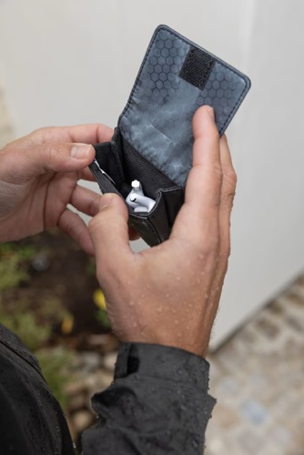

尽管现在不少产品都有防水功能，但也要一个万全之策，所以这个产品的思路确实很契合小众需求，就是有点贵。

当然，也不能太理想化它的功能，要是家里有个泡过水的手机，之前没有解决的，现在要不要花这200多买回来试试，咱也是没必要，它可没保证“泡水手机放进去一定能解决”啊！

还有，前面提到的内衬靠材料发挥的吸湿功能，咱正常思路想，这能力本来就有上限和欠缺，时间长不说，大概率也没有抽湿这类设备那种猛。

所以综合看下来，感觉还是有一定用户市场，现在手机啥的越来越贵，配件市场往防护、应急、便携等方向发展，也确实合理。

也不能说是智商税吧，小众市场有需求、技术创新有卖点，就是贵了点，你们觉得呢？

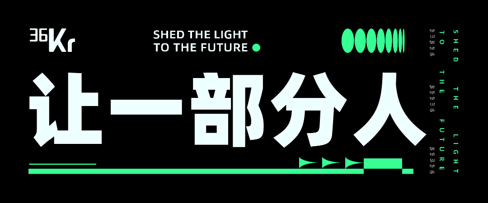

